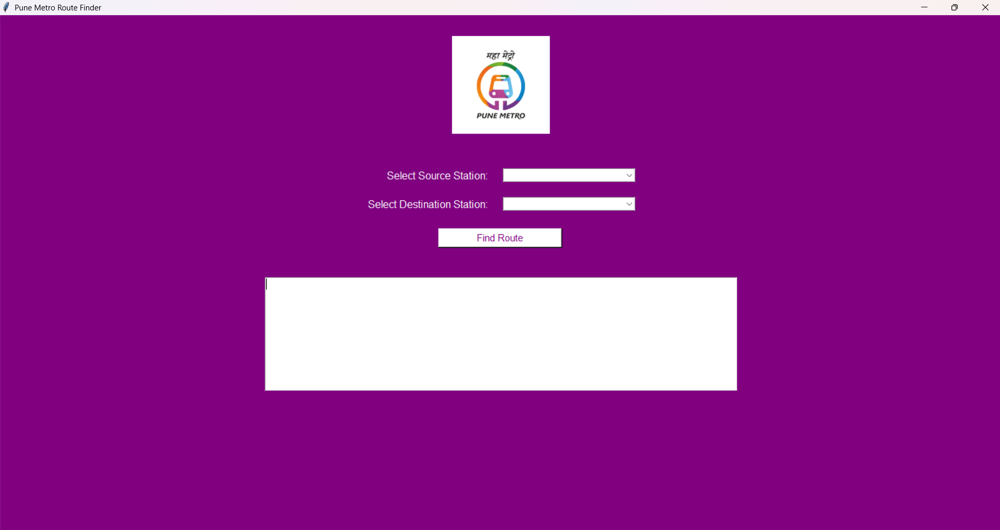
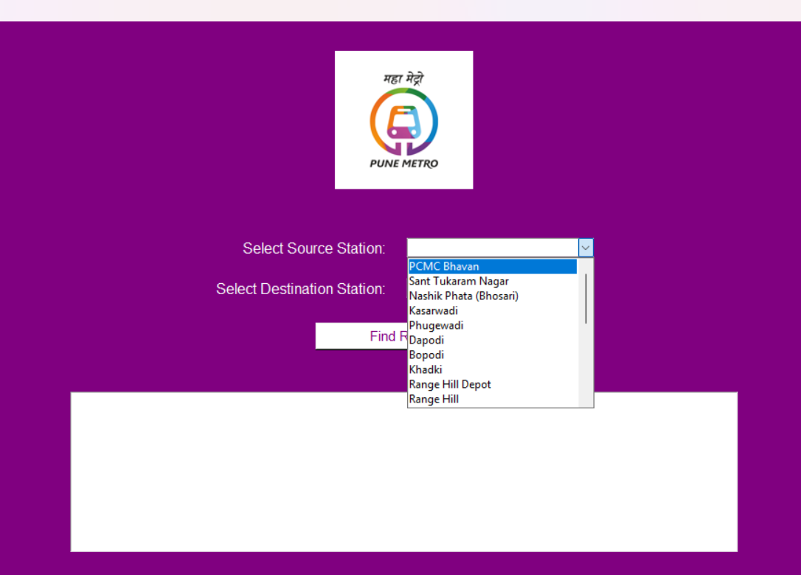
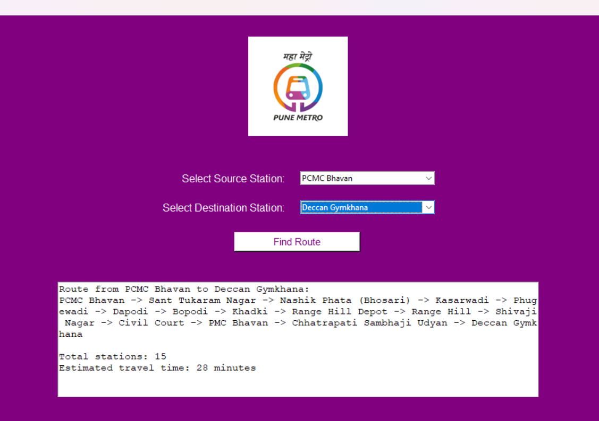

# Pune Metro Route Finder

The Pune Metro Route Finder is a simple desktop application built to help users easily figure out metro routes between stations in Pune.  

 As someone who has personally traveled in both the Purple Line and the Aqua Line, I found that understanding routes, interchanges, and directions can be quite confusing—especially for someone using the metro system for the first time.

This project was created to solve that exact problem. Instead of manually trying to understand station sequences or maps, users can simply select a source and destination station and instantly get the shortest route along with an estimated travel time.

## Features

- Interactive graphical user interface
- Supports Pune Metro Purple Line and Aqua Line

- Dropdown-based station selection
- Shortest route computation
- Estimated travel time calculation

## Tech Stack

- Python 3
- Tkinter – GUI development
- PIL (Pillow) – Image handling for logo
- Heapq – Priority queue implementation
- Graph Data Structure
- Dijkstra’s Algorithm

## Project Structure

PuneMetro-RouteFinder/

│

├── 
gui_main.py        # Main GUI application

├── 
algorithms.py     # Route-finding algorithm (Dijkstra)

├── 
metro_data.py     # Metro stations and connectivity graph

├── 
logo.jpg           

└── 
README.md

## Algorithm

Dijkstra’s Algorithm

- Computes the shortest path from source to destination
- Uses a priority queue for efficient traversal
- Guarantees optimal path selection in weighted graphs
- In this project, each station hop has a constant weight (2 minutes)
## How it works

1. The metro network is modeled as a graph, where:
- Nodes represent metro stations
- Edges represent direct connectivity between stations 

2. When a user selects source and destination stations, the system:
- Applies Dijkstra’s algorithm to compute the shortest path 
- Assumes a fixed travel time of 2 minutes per station

3. The GUI displays:
- Route path
- Total number of stations
- Estimated travel time 
## Screenshots

## Future Enhancements

- Dynamic travel time calculation
- Fare estimation
- Real-time metro data integration
- Map-based visualization
- Mobile or web-based version

## Author

Atharva Pawar   
Computer Science Engineering Student
